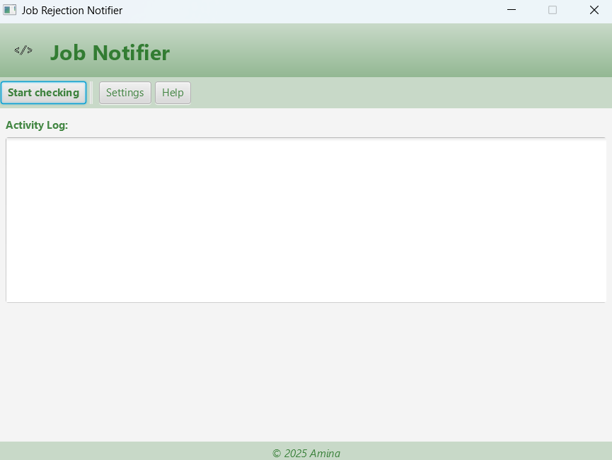
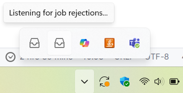

# Email AI Notifier
This project is being developed as part of an AI Hackathon. The goal is to build a personal smart email monitoring system that can scan job-related emails, extract relevant information, and send custom notifications to the user based on preferences. 

---

## Current Status

> This is an early-stage prototype. The following features are **already implemented**:

###  Basic Email Fetching (Gmail IMAP)
- Connects to a Gmail inbox using JavaMail API.
- Fetches the 5 most recent emails from the inbox.
- Extracts and prints:
    - Sender (From)
    - Subject line
    - Plain text content (if available)
- Console-based display for debugging and iteration.

### Rejection Detection With Notifications (draft I)
- Uses heuristic pattern matching to detect job rejection emails.
- Analyzes:
    - Common rejection phrases
    - Keyword frequency
    - HR/recruiter sender domains
- Emails are categorized as either REJECTION or OTHER.
- Desktop notifications (via NotificationUtil) are triggered when a rejection is detected, helping
users stay informed immediately.

### Email Classification via OpenAI
- Each incoming email is sent to the OpenAI API for natural language analysis. The model extracts key information such as:
   - Subject
   - Company
   - Category (REJECTION, OTHER)
Only emails classified as REJECTION trigger a system notification.

### Application GUI
Application interface provided for visualizing the rejection emails and notifications.
  
---

## Screenshots
Application main page interface.
 1. Start Checking button: begins monitoring for job updates in the email configured
2. Settings button: configure application preferences (to be added later)
3. Help button: access documentation and support

Activity log provides real-time updates. 



A System Tray Icon ensures the app runs discreetly in the background without interrupting the user
experience. It serves for real-time alerts displaying instant desktop notifications for new rejection emails. 
Right-clicking the tray icon provides a shortcut to open or exit the application.



---
## Tech Stack

- Java 17+
- JavaMail API
- [dotenv-java](https://github.com/cdimascio/dotenv-java) for env management
- Maven (for dependency management and build)

---

##  Project Structure
```
com.amina.jobnotifier/
├── app/                     # Main application entry point
├── controller/              # Handles user-level actions
├── service/                 # Email logic (fetching, parsing, classification)
├── model/                   # Email message and email account model
└── util/                    # MIME/text decoding helpers and notification helpers
```

## A/N
The app at the moment serves for personal uses only. More features will be implemented in the future.

treat people with kindness :)
